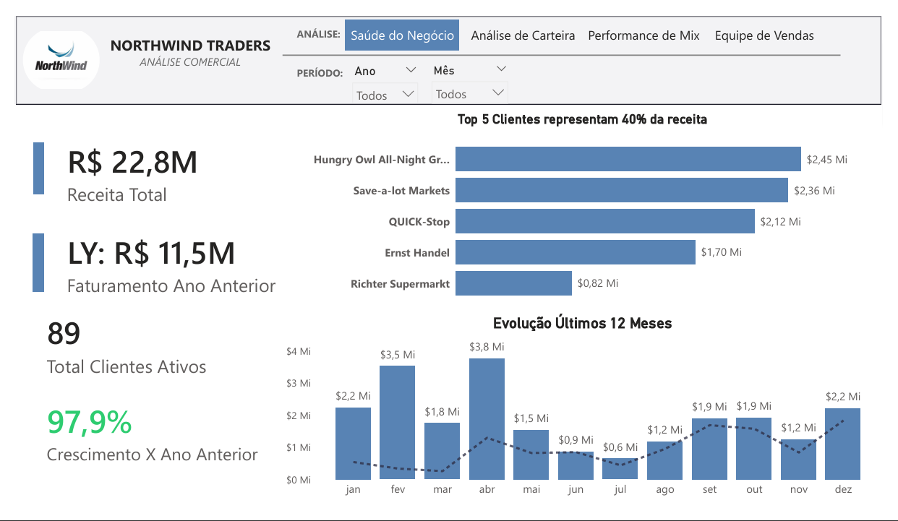
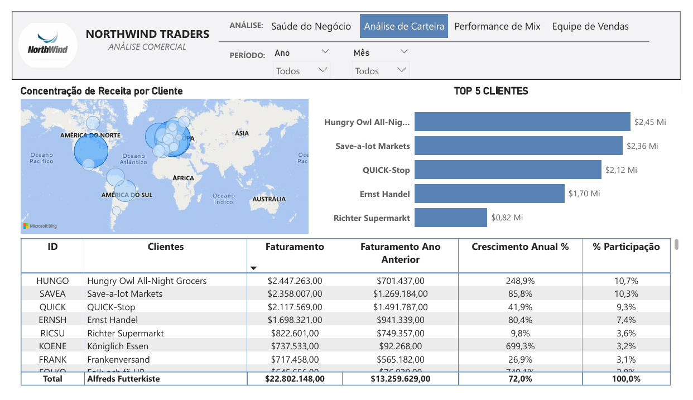
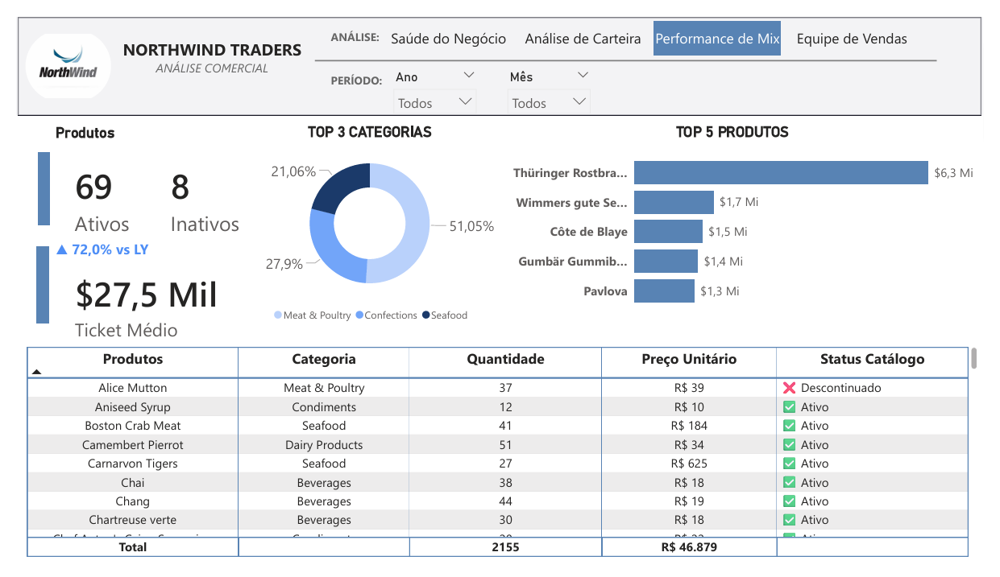
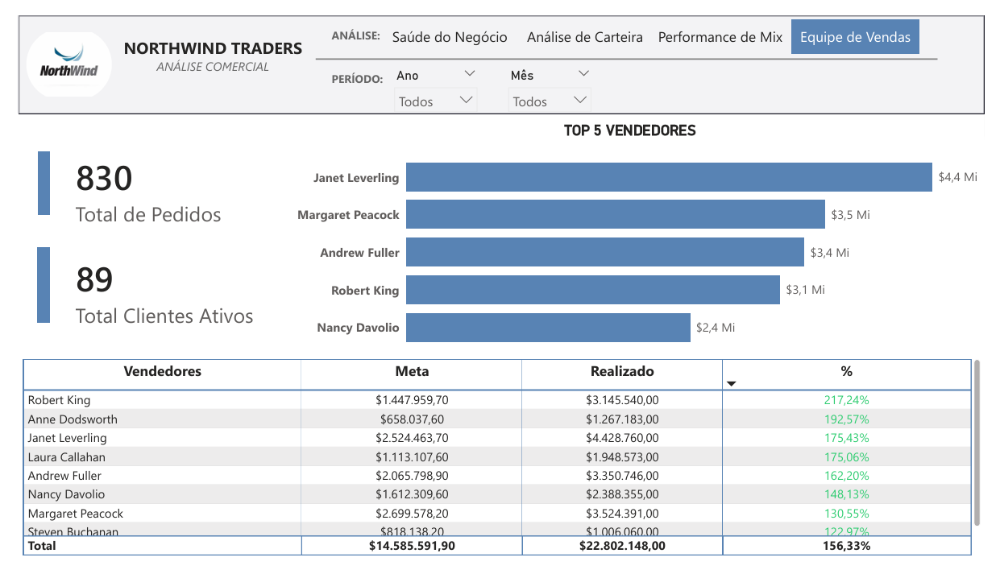

# 📊 Northwind Traders — Dashboard Estratégico Comercial

## 📌 Sobre o Projeto

Dashboard estratégico desenvolvido em Power BI Desktop com o dataset 
**Northwind Traders** (Kaggle), simulando uma análise comercial completa 
para o dono de uma distribuidora de alimentos.

O projeto cobre toda a cadeia analítica: da modelagem de dados até o 
storytelling visual, com foco em decisões de negócio reais.

---

## 🖥️ Páginas do Dashboard

### 1. Visão Geral

### 2. Clientes & Mercados

### 3. Produtos & Categorias

### 4. Equipe de Vendas

---

## ❓ Perguntas de Negócio Respondidas

O dashboard foi construído para responder 4 perguntas estratégicas:

| # | Pergunta | Página |
|---|---|---|
| 1 | Como está a saúde financeira do negócio comparado ao ano anterior? | Visão Geral |
| 2 | Quais clientes concentram a maior parte da receita e onde estão geograficamente? | Clientes & Mercados |
| 3 | Quais categorias e produtos lideram as vendas e qual é a tendência de cada um? | Produtos & Categorias |
| 4 | Qual vendedor está performando melhor e qual está abaixo da média? | Equipe de Vendas |

---

## 🎨 Justificativa do Design

### Estilo Corporativo — Por que não tema escuro?
O design seguiu o padrão de ferramentas enterprise como TARGIT e SAP 
Analytics Cloud: fundo claro `#F8F9FA`, tipografia Segoe UI e paleta 
monocromática em azul corporativo `#1B3A6B`.

Essa escolha foi intencional — o público-alvo é a **diretoria de uma 
distribuidora B2B**, não um público técnico de TI. Dashboards claros 
transmitem objetividade e são mais legíveis em reuniões presenciais e 
projeções.

### Estrutura de Layout — Visão Geral → Detalhamento
Cada página segue a mesma lógica:
- **Coluna esquerda:** KPIs consolidados para leitura rápida
- **Quadrante superior direito:** Gráficos de apoio (Top 5 + Evolução)
- **Matriz inferior:** Detalhamento completo com hierarquia expansível

Essa estrutura permite que o gestor consuma o insight em 3 segundos 
nos cartões ou aprofunde na matriz quando necessário.

### Navegação — Navegador de Páginas Nativo
Em vez de botões customizados, utilizei o componente nativo de 
navegação do Power BI, simulando abas de sistema ERP — familiar para 
o perfil de usuário corporativo.

---

## 📐 Modelagem de Dados

### Star Schema
O modelo segue o padrão Star Schema com separação clara entre 
tabelas fato e dimensão:

**Tabelas Fato:**
- `Fato_Vendas` — granularidade de pedido
- `Fato_Vendas_Detalhes` — granularidade de item de pedido

**Tabelas Dimensão:**
- `Dim_Clientes`
- `Dim_Produtos`
- `Dim_Categorias`
- `Dim_Funcionarios`
- `Dim_Transportadoras`
- `Dim_Calendario` — tabela de datas dedicada, marcada como 
  tabela de datas oficial do modelo

### Por que manter Fato_Vendas e Fato_Vendas_Detalhes separadas?
As duas tabelas possuem granularidades diferentes — uma linha em 
`Fato_Vendas` representa um pedido completo, enquanto uma linha em 
`Fato_Vendas_Detalhes` representa um produto dentro de um pedido. 
Mesclá-las causaria duplicação de dados e distorção em cálculos de 
frete e contagem de pedidos.

---

## 📊 Indicadores (KPIs) Criados

### KPIs Primários
| Medida | Descrição |
|---|---|
| Receita Total | Soma iterada via SUMX garantindo precisão linha a linha |
| Total de Pedidos | DISTINCTCOUNT de OrderID evitando dupla contagem |
| Ticket Médio | DIVIDE seguro entre Receita Total e Total de Pedidos |
| Total Clientes Ativos | Clientes com ao menos 1 pedido no período |

### KPIs de Inteligência Temporal
| Medida | Descrição |
|---|---|
| Faturamento MTD | Acumulado do mês filtrado via DATESMTD |
| Faturamento MTD LY | Mesmo período do ano anterior para comparação |
| Variação % MTD vs LY | Crescimento relativo com DIVIDE seguro |
| Crescimento Anual % | Variação anual via SAMEPERIODLASTYEAR |

### KPIs Avançados
| Medida | Descrição |
|---|---|
| % Participação Cliente | ALLSELECTED para respeitar filtros externos |
| % Participação Produto | Mesma lógica aplicada à dimensão de produtos |
| Ranking Clientes | RANKX com DENSE evitando saltos no ranking |
| Ranking Vendedores | Mesma lógica para dimensão de funcionários |

### KPIs Adicionais
| Medida | Descrição |
|---|---|
| Clientes Novos | Clientes que aparecem pela primeira vez no período selecionado |
| Top Categoria | Categoria com maior receita no período filtrado |
| Mês Pico | Mês com maior faturamento no período analisado |
| Label Crescimento | Rótulo dinâmico de texto para exibição visual do crescimento |
| Última Data | Âncora temporal baseada na última data do dataset |
| Total Produtos Ativos | Produtos com status ativo no catálogo |
| Total Produtos Descontinuados | Produtos retirados do catálogo |
| Variação MTD Formatada | Variação % formatada com ícone direcional ▲▼ |

---

## 🛠️ Tecnologias e Técnicas

- **Power BI Desktop** — desenvolvimento do dashboard
- **Power Query (M)** — ETL e limpeza dos dados
- **DAX Avançado** — 28 medidas incluindo Time Intelligence e KPIs dinâmicos
- **Star Schema** — modelagem dimensional
- **Formatação Condicional** — cor dinâmica por performance
- **Navegador de Páginas Nativo** — UX corporativa

---

## 📁 Estrutura do Repositório

northwind-traders-dashboard/
│
├── NorthwindTraders.pbix
├── README.md
└── assets/
├── visao-geral.png
├── clientes.png
├── produtos.png
└── equipe-vendas.png

---

## 👤 Autor

**Yuri Catunda**  
